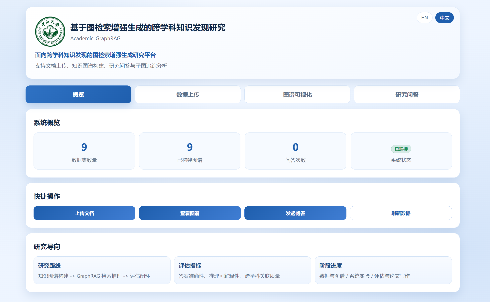
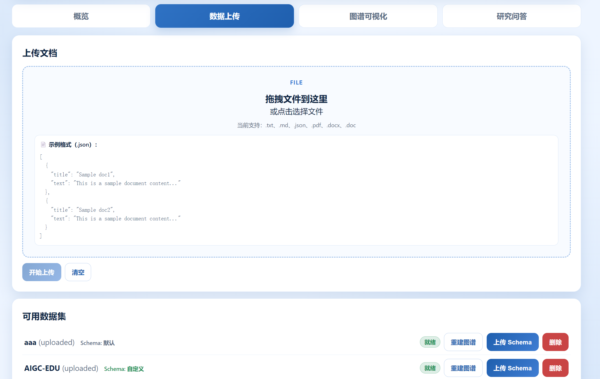
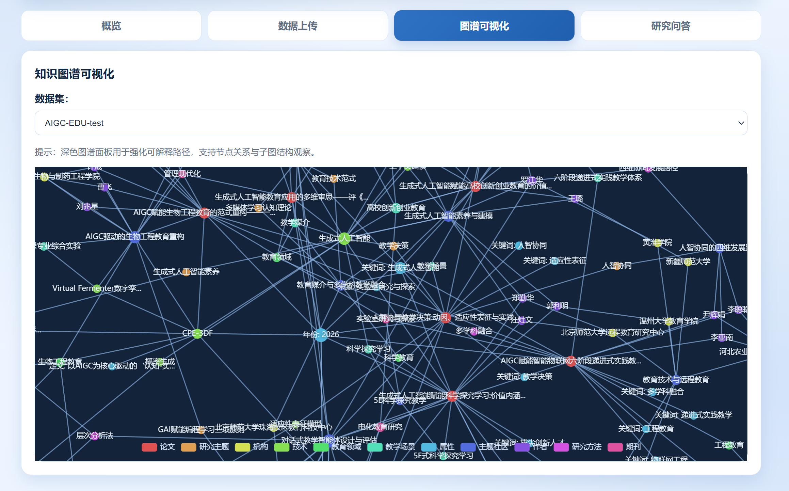
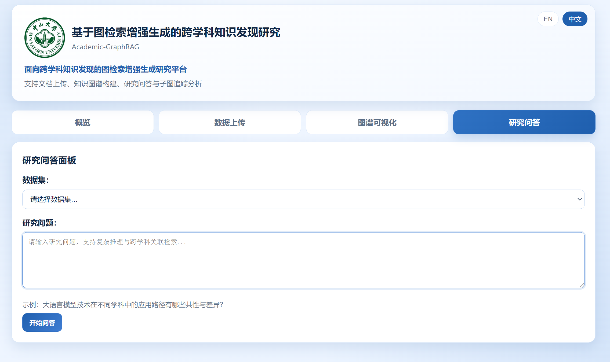

# 🚀 Academic GraphRAG 完整指南

<div align="center">
  
  
  **从安装到使用的完整指南：面向跨学科知识发现的 GraphRAG 研究原型**
  
  [⬅️ 返回主页](README.md) | [🌐 English Version](FULLGUIDE-EN.md)
</div>

---

## 📋 目录
- <a href="#environment-preparation">⚙️ 环境准备</a>
- <a href="#web-interface-experience">💻 Web 界面使用流程</a>
- <a href="#command-line-usage">🛠️ 命令行使用（CLI）</a>
- <a href="#evaluation-workflow">⚖️ 评测工作流</a>
- <a href="#configuration-details">⚙️ 高级配置解析</a>
- <a href="#troubleshooting">🔧 常见问题与优化</a>

---

<a id="environment-preparation"></a>
## ⚙️ 环境准备

本项目支持 Docker 部署与本地 Python 环境安装。推荐使用 **虚拟环境** 以避免依赖冲突。

### 1. 基础安装 (本地)
```bash
# 克隆项目
git clone https://github.com/Morris1029/Academic_graphRAG.git
cd academic-graphrag

# 安装依赖
pip install -r requirements.txt
pip install -r requirements-server.txt

# 下载中文 NLP 模型 (学术文献处理核心)
python -m spacy download zh_core_web_lg
```

### 2. 核心环境变量配置 (`.env`)
复制 `.env.example` 并重命名为 `.env`。项目支持按任务分配不同的 LLM 模型：

```env
# 通用默认配置
LLM_MODEL=deepseek-chat
LLM_BASE_URL=https://api.deepseek.com
LLM_API_KEY=your_key

# 【高级】针对构建与问答单独配置 (推荐)
KG_LLM_MODEL=qwen-max
KG_LLM_BASE_URL=https://dashscope.aliyuncs.com/compatible-mode/v1
KG_LLM_API_KEY=sk-xxxx

RAG_LLM_MODEL=deepseek-reasoner
RAG_LLM_BASE_URL=https://api.deepseek.com
RAG_LLM_API_KEY=sk-xxxx
```

### 3. 多格式文档解析支持 (可选)
如果需要处理 `.pdf`, `.docx`, `.doc` 等复杂格式，建议运行环境初始化脚本：
```bash
chmod +x setup_env.sh
./setup_env.sh
```
*该脚本会自动检测并尝试安装 Java (提供 Tika 支持) 以及 Antiword (提供 .doc 支持)。*

---

<a id="web-interface-experience"></a>
## 💻 Web 界面使用流程

Web 界面提供了直观的交互方式，适合进行数据集管理和构图过程可视化。

<div align="center">
  
</div>

### 启动服务
```bash
# 使用启动脚本
chmod +x start.sh
./start.sh
# 或直接运行后端
python backend.py
```
访问地址：`http://localhost:8000`

### 核心操作步骤
1.  **数据上传**：在“数据上传”标签页，您可以拖拽上传 `.pdf`, `.txt`, `.json` 等文档。系统会自动识别编码并进行格式化处理。
    <div align="center"></div>
2.  **Schema 定义**：默认为每个数据集关联通用学术 Schema。如有特殊需求，可在上传数据集后单独上传自定义 Schema。
3.  **图谱构建**：在“图谱可视化”标签页点击“构建图谱”。由于构图涉及大量 LLM 调用，建议在 `base_config.yaml` 中根据 API 限流情况调整 `max_concurrent_llm_requests`。
    <div align="center"></div>
4.  **研究问答**：进入“研究问答”界面，选择已构建的数据集。系统在 `agent` 模式下会自动拆解问题并进行多轮迭代检索。
    <div align="center"></div>

---

<a id="command-line-usage"></a>
## 🛠️ 命令行使用（CLI）

CLI 适合执行批量任务或在服务器环境下运行。

### 1. 全流程启动
```bash
# 对 demo 数据集执行 构图 + 检索
python main.py --datasets demo
```

### 2. 行为自定义 (Override)
您可以通过 `--override` 参数实时修改 `base_config.yaml` 中的任何配置：
```bash
# 只构图，不检索 (关闭检索触发器)
python main.py --datasets demo --override "{\"triggers\": {\"constructor_trigger\": true, \"retrieve_trigger\": false}}"

# 使用基础模式 (noagent) 以提升响应速度
python main.py --datasets demo --override "{\"triggers\": {\"mode\": \"noagent\"}}"
```

---

<a id="evaluation-workflow"></a>
## ⚖️ 评测工作流

作为研究原型，本项目提供了独立的评测框架，位于 `eval/` 目录下。

### 1. 知识图谱构建评测 (`kg_eval`)
衡量由不同 LLM 抽取的实体/三元组与 Gold 数据的一致性。
```bash
# 1. 生成 Gold 数据草案
python -m eval.kg_eval.run generate_gold
# 2. 启动批量抽取与对比评测
python -m eval.kg_eval.run run
```

### 2. 问答质量评测 (`rag_eval`)
基于 LLM-as-a-Judge，对生成的答案进行多维度打分。
```bash
# 执行基于 AIGC-EDU-test 数据集的全自动化回答与打分
python -m eval.rag_eval.run --dataset AIGC-EDU-test --qa-mode agent
```
*评测结果将保存至 `eval/results/` 目录下。*

---

<a id="configuration-details"></a>
## ⚙️ 高级配置解析 (`base_config.yaml`)

| 参数组 | 核心参数 | 说明 |
| :--- | :--- | :--- |
| **construction** | `chunk_size` | 文档切片大小。学术文献建议 1000 左右以保持上下文连贯。 |
| | `mode: agent` | `agent` 模式会利用 CoT 进行更细致的抽取，速度较慢但质量高。 |
| | `max_workers` | 本地 CPU 并发数（控制解析/IO）。 |
| **retrieval** | `top_k: 20` | 初步召回的 Chunk 和三元组数量。 |
| | `similarity_threshold` | FAISS 检索的相似度阈值。 |
| **embeddings** | `device: cpu` | 若显存充足，可设为 `cuda` 以加速向量化。 |

---

<a id="troubleshooting"></a>
## 🔧 常见问题与优化

### 1. FAISS 报错 `Segmentation fault: 11`
处理大规模节点（例如 5000+）时，由于 OpenMP 并发冲突可能会导致崩溃。
**解决方案**：在运行脚本前执行 `export OMP_NUM_THREADS=1`。

### 2. 构图失败或 LLM 响应不完整
- 检查 `config/base_config.yaml` 中的 `llm_timeout_seconds`。复杂抽取任务建议设为 90s 以上。
- 若网络不稳定，可调节 `retry_attempts` 控制自动重试。

### 3. 数据一致性检查
如果怀疑构图过程异常，可运行：
```bash
# 检查指定数据集的 Source/Chunk/Graph 一致性
python backend.py --dataset-audit <name>
```

---

<div align="center">
  
  **🌟 诚挚欢迎贡献代码或提出反馈 🌟**
  
  [⬅️ 返回主页](README.md)
  
</div>
