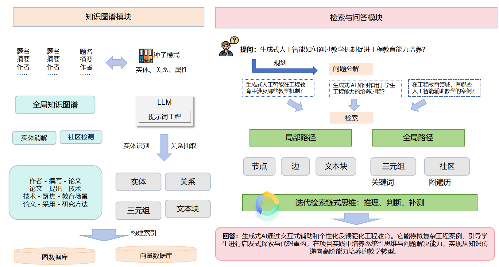
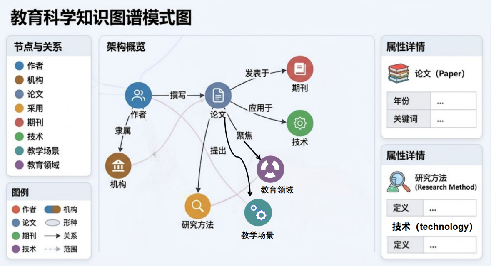
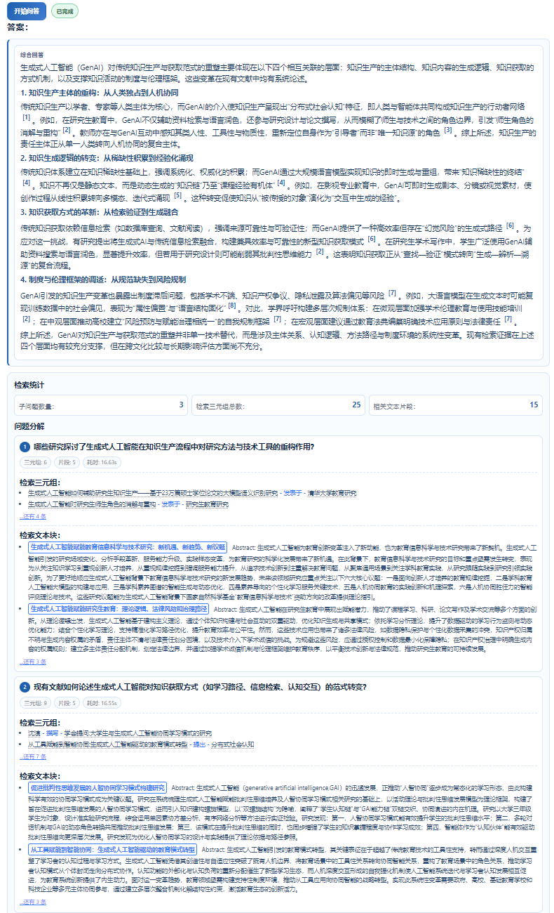
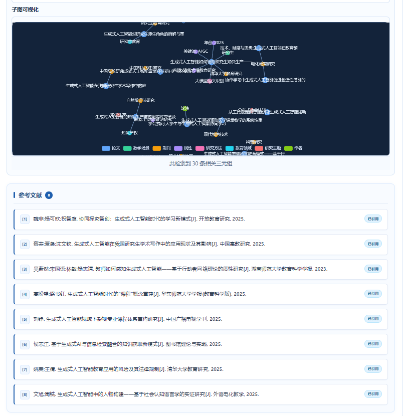

<div align="center">
  <h1>🧬 Academic-GraphRAG</h1>
  <p><b>A New Paradigm for Graph-Enhanced Interdisciplinary Reasoning</b></p>
</div>

<div align="center">
  
  
  
</div>

<p align="center">
  🚀 Redefining academic retrieval-augmented reasoning, supporting multi-hop complex reasoning, knowledge extraction, and interdisciplinary discovery/evaluation.
</p>

<p align="center">
  <a href="README.md">中文版</a> •
  <a href="#research-positioning">Research Positioning</a> •
  <a href="#evaluation-flow">Evaluation Flow</a> •
  <a href="#quick-start">Quick Start</a> •
  <a href="FULLGUIDE-EN.md">Full Guide</a>
</p>

---

# Interdisciplinary Knowledge Discovery Research Based on Graph Retrieval-Augmented Generation (GraphRAG)

## Project Introduction
This project is a GraphRAG research prototype system for interdisciplinary knowledge discovery, implemented around the paper "Research on Interdisciplinary Knowledge Discovery Based on Graph Retrieval-Augmented Generation". Taking scientific literature as the object, it supports the discovery of potential interdisciplinary associations from unstructured academic texts through the complete chain of "LLM Knowledge Extraction + Knowledge Graph Construction + Graph Retrieval-Augmented QA + Evaluation Analysis".

<div align="center">
  
</div>

The current implementation focus of the repository has further converged from a general GraphRAG framework to the following research objectives:

- Constructing structured knowledge graphs for interdisciplinary scientific literature
- Supporting complex question retrieval, decomposition, and reasoning based on graphs
- Using AIGC/LLM educational application literature as the main experimental samples
- Providing two sets of experimental toolchains: knowledge graph construction evaluation and QA evaluation
- Providing a Web prototype interface for convenient data upload, graph construction, QA, and visual analysis

## Research Positioning
In conjunction with the current content of the paper, this project focuses on "interdisciplinary scientific knowledge discovery" rather than general chat QA. Core questions include:

1. How to automatically construct interdisciplinary scientific knowledge graphs based on literature metadata.
2. How to use GraphRAG to improve the efficiency, coverage, and interpretability of interdisciplinary knowledge discovery.
3. How to design an evaluation system around knowledge graph construction quality and QA quality, and support comparative experiments between different models.

The current research samples focus on "Research on the Application of Large Language Models in the Field of Education", so you will see datasets like `AIGC-EDU`, `AIGC-EDU-test`, and the construction and evaluation results organized around them in the repository.

## Tech Stack
*   🐍 **Python**: Core development language
*   🚀 **FastAPI**: High-performance Web service backend and HTTP/WebSocket interface
*   🧠 **LLM API**: Supports split integrated multi-model calls (e.g., DeepSeek, Qwen, etc.)
*   🕸️ **NetworkX**: Storage, processing, and community detection of graph-structured data
*   🔍 **FAISS**: Local feature vector retrieval engine for text chunks
*   📊 **ECharts**: Interactive knowledge graph data visualization for the frontend

## Current System Capabilities

### 1. Literature Upload and Dataset Management
- Supports uploading `.txt`, `.md`, `.json`, `.pdf`, `.docx`, `.doc` via the Web interface
- Automatically generates `data/uploaded/<dataset_name>/corpus.json`
- Supports dataset listing, deletion, graph reconstruction, and uploading custom schemas
- Built-in `demo` dataset for quick verification of the process

### 2. Knowledge Graph Construction

- Main construction entry points: `main.py` and `backend.py`
- Core construction module: `models/constructor/kt_gen.py`
- Supports entity, relation, and attribute extraction based on schema
- Supports cross-document linking, community detection, chunk auditing, and graph output
- Outputs are saved to `output/graphs/`, `output/chunks/`, `output/logs/`

### 3. Graph Retrieval-Augmented QA
- Supports `agent` and `noagent` modes
- `agent` mode includes question decomposition, sub-question processing, iterative retrieval, and reasoning
- Retrieval module works based on graph, FAISS, and chunk evidence
- Supports graph visualization, QA process display, and retrieval result echo

### 4. Evaluation and Experimentation
- `eval/kg_eval/`: Knowledge graph construction quality evaluation
- `eval/rag_eval/`: QA quality evaluation
- `eval/utils/sample_kg_eval_stratified.py`: Stratified random sampling
- Supports gold generation, candidate model comparison, cross-doc review template export, and Markdown report generation

## Technical Route and Implementation Mapping
The three main lines in the paper correspond to the code as follows:

| Research Main Line | Corresponding Implementation |
| --- | --- |
| Scientific Literature Knowledge Extraction and Semantic Fusion | `models/constructor/kt_gen.py`, `utils/document_parser.py`, `schemas/` |
| Graph Retrieval-Augmented Generation and Interdisciplinary QA | `models/retriever/agentic_decomposer.py`, `models/retriever/enhanced_kt_retriever.py`, `backend.py` |
| Evaluation System Construction and Model Comparison | `eval/kg_eval/`, `eval/rag_eval/`, `test_kg_eval.py` |

## Project Structure
Below are the most important directories and files in the current repository:

```text
youtu-graphrag/
├─ backend.py                  # FastAPI backend and Web interface
├─ main.py                     # CLI main entry: Run before construction / retrieval / evaluation
├─ config/
│  ├─ base_config.yaml         # Main configuration file
│  └─ config_loader.py         # Config loading and path standardization
├─ frontend/
│  ├─ index_new.html           # Frontend page
│  ├─ script.js                # Frontend interaction logic
│  └─ style.css                # Page styles
├─ models/
│  ├─ constructor/
│  │  └─ kt_gen.py             # Core knowledge graph construction
│  └─ retriever/
│     ├─ agentic_decomposer.py # Question decomposition
│     ├─ enhanced_kt_retriever.py
│     └─ faiss_filter.py       # FAISS retrieval
├─ utils/
│  ├─ document_parser.py       # Multi-format document parsing
│  ├─ call_llm_api.py          # LLM call encapsulation
│  ├─ dataset_audit.py         # Dataset consistency audit
│  ├─ tree_comm.py             # Community detection related tools
│  └─ paths.py                 # Repository root path parsing
├─ data/
│  ├─ demo/                    # demo dataset
│  └─ uploaded/                # Datasets uploaded via Web
├─ schemas/                    # Dataset schema
├─ output/
│  ├─ graphs/                  # Graph output
│  ├─ chunks/                  # Chunk output
│  └─ logs/                    # Execution logs
├─ eval/
│  ├─ kg_eval/                 # Construction evaluation
│  ├─ rag_eval/                # QA evaluation
│  ├─ utils/                   # Evaluation auxiliary scripts
│  └─ results/                 # Evaluation results
├─ test_kg_eval.py
└─ test_sample_kg_eval_stratified.py
```

## Environment Requirements
- Python 3.10+
- Virtual environment recommended
- Can run on CPU; for faster embedding or construction, GPU environment can be expanded
- For better compatibility with document parsing, it is recommended to prepare Java runtime (for Apache Tika)

Main dependencies see:

- `requirements.txt`
- `requirements-server.txt`
- `requirements-optional.txt`

## LLM Environment Variables
The project supports splitting model configurations by task:

### General Default Config
```env
LLM_MODEL=deepseek-chat
LLM_BASE_URL=https://api.deepseek.com
LLM_API_KEY=your_key
```

### Optional: Separate Config for Construction and QA
```env
KG_LLM_MODEL=qwen3-max
KG_LLM_BASE_URL=https://dashscope.aliyuncs.com/compatible-mode/v1
KG_LLM_API_KEY=your_key

RAG_LLM_MODEL=deepseek-chat
RAG_LLM_BASE_URL=https://api.deepseek.com
RAG_LLM_API_KEY=your_key
```

If using Azure OpenAI, you can also supplement:

```env
OPENAI_PROVIDER=azure
API_VERSION=2025-01-01-preview
```

The evaluation module uses separate environment files:

- `eval/.env`
- `eval/rag_eval/.env`

## Quick Start

### 1. Install Dependencies
```bash
pip install -r requirements.txt
```

If processing Chinese text, it is recommended to install the Chinese spaCy model:

```bash
python -m spacy download zh_core_web_lg
```

### 2. Configure Environment Variables
Refer directly to `.env.example` in the root directory.

### 3. Start Web Prototype
```bash
python backend.py
```

After starting, access:

```text
http://localhost:8000
```

### 4. Use CLI for Construction/Retrieval
```bash
python main.py --config config/base_config.yaml --datasets demo
```

If you only want to run specific processes, you can use `--override` combined with `triggers` in the config:

```bash
python main.py --datasets demo --override "{\"triggers\": {\"constructor_trigger\": true, \"retrieve_trigger\": false}}"
```

## Web Usage Flow
<div align="center">
  
</div>

The current frontend interface mainly supports the following processes:

1. Upload documents and generate datasets
<div align="center"></div>

2. Upload custom schema for the dataset (optional)
3. Build knowledge graph
4. View graph visualization
<div align="center"></div>

5. Select dataset for research QA
<div align="center"></div>

**Below are some QA examples:**
<div align="center">
  
  
</div>

6. Reconstruct or delete existing datasets

Core backend interfaces are located in `backend.py`, including:

- `GET /api/datasets`
- `POST /api/upload`
- `POST /api/construct-graph`
- `POST /api/ask-question`
- `GET /api/graph/{dataset_name}`
- `GET /api/dataset-audit/{dataset_name}`

## Config Description
The main configuration file is `config/base_config.yaml`. The current default settings reflect your research scenario:

- `active_dataset: demo`
- `construction.mode: agent`
- `nlp.spacy_model: zh_core_web_lg`
- `datasets.demo` points to `data/demo/`
- Output directory unified to `output/`

You can focus on the following sets of parameters:

- `construction.*`: Construction, chunking, cross-doc linking, concurrency control
- `retrieval.*`: Retrieval parameters, recall paths, cache directory
- `triggers.mode`: `agent` / `noagent`
- `datasets.*`: Corpus, QA set, schema, graph output location

## Evaluation Flow

### 1. Knowledge Graph Construction Evaluation
Config file:

- `eval/kg_eval/config.yaml`

Common commands:

```bash
python -m eval.kg_eval.run generate_gold
python -m eval.kg_eval.run run
python -m eval.kg_eval.run cross_doc_review
```

This module is used for:

- Gold labeling draft generation
- Comparison between candidate extraction results and gold
- Graph structure and cross-doc linking quality analysis
- Automatic generation of evaluation reports

### 2. QA Evaluation
Config file:

- `eval/rag_eval/config.yaml`

Common commands:

```bash
python -m eval.rag_eval.run
python -m eval.rag_eval.run --dataset AIGC-EDU-test --qa-mode agent
```

This module is used for:

- Reading question sets
- Calling the current GraphRAG process to generate answers
- Using a review model to score based on accuracy, completeness, logic, interpretability, interdisciplinarity, etc.
- Generating structured results and summary reports

## Testing
Basic tests already exist in the repository:

```bash
python test_kg_eval.py
python test_sample_kg_eval_stratified.py
```

If you just want to verify that the backend can serve datasets and pages correctly, you can also run directly:

```bash
python backend.py
```

## Understanding the Project in the Context of the Paper
In short, the project can be understood as:

> This is a GraphRAG experimental platform for interdisciplinary scientific literature knowledge discovery, focusing on solving three problems: "how to convert academic text into graphs, how to perform QA based on graphs, and how to evaluate the effectiveness of graph construction and QA".

Compared to the original general GraphRAG introduction, this repository emphasizes:

- Academic literature and interdisciplinary knowledge discovery
- Research samples related to Large Language Models in education scenarios
- Reproducibility of evaluation
- Combination of Web prototype and experimental tools

## Related Documents
- `FULLGUIDE-CN.md`: Relatively complete instructions in Chinese
- `FULLGUIDE.md`: Complete instructions in English
- `README-CN.md`, `README-JA.md`: Historical multilingual instructions
- `AGENTS.md`: Repository collaboration instructions for developing agents

## Notes
- Current README is written centered on "your research implementation version" and no longer fully follows the statement of the upstream general project.
- If you plan to publish the repository publicly later, it is recommended to add:
  - Research data source description
  - Model selection basis
  - Reproducible experiment tables
  - Typical QA cases
  - Correspondence between paper citations and versions

## Contribution Guidelines
We warmly welcome contributions from open-source academic and industrial software partners.
1. **Issue Reports**: If you find bugs or have new feature suggestions during experience, welcome to submit Issues for discussion.
2. **Submit Code**: Please Fork the project, switch to your personal development branch (e.g., `feature/your-feature`), implement, and submit a Pull Request after fully executing unit tests (refer to existing test scripts).
